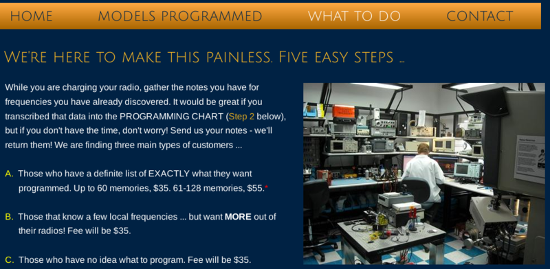
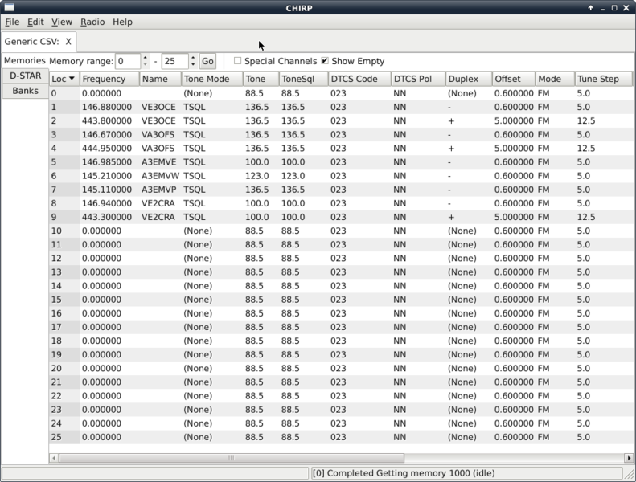
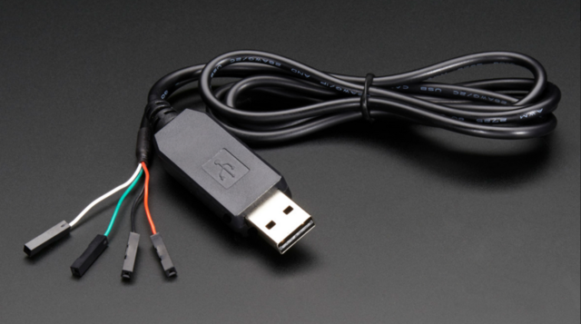

.. include:: <s5defs.txt>

========================
CHIRP Memory Programming
========================

.. class:: center

Tyler Tidman VA3DGN

.. |date| date:: January 6, 2015
.. |Location| replace:: West-Carleton ARC

Modern Transceivers
===================

.. class:: incremental

* DC-to-daylight mobile rigs and HTs
* 1000+ "channel" memories
* tiny screens, big manuals
* fancy-combo button presses
* cryptic symbols (e.g.: "R")

Usability
=========

.. image:: images/pirate_keyboard.png

.. class:: tiny

* Image by Bobby Baker

G.I.G.O.
========

.. class:: incremental

* a few spare transceivers
* lend them out for events
* configure them all the same
* hundreds of button presses
* wrong tones, offsets?

Remote Assistance
=================

.. class:: tiny

* Image from http://hamradioprogramming.com

Software Solution
=================

.. class:: incremental

* sold as an accessory, for more $$$
* works on only 1 OS and/or version
* usually different for each rig
* uses custom data formats
* nearly impossible to diagnose errors

Helpful Messages
================

* "Windows Error 587" -> ERROR_MUTANT_LIMIT_EXCEEDED

.. image:: images/teenage_mutant_ninja_cat.png

.. class:: tiny

* Image from http://icanhascheezburger.com

Enter CHIRP
===========

.. class:: incremental

* over 100 radios supported
* new ones added all the time
* costs nothing, royalty-free
* open, non-proprietary data formats
* will run on nearly every OS (Python + GTK)

Zarro Boogs
===========

  "There are two ways to write error-free programs;
  Only the third one works."

  -- Anonymous

OSes
====

.. class:: incremental

* Windows XP, Vista, 7, 8, 8.1 and so on
* Linux, Mac OS X, (Unix, BSD, Solaris, etc.)

.. image:: images/unix_system.png

.. class:: tiny

* Image from Jurassic Park (1993)

.. container:: handout

  The scene from the movie involved using the tool known as Fsn_.

  Another really excellent tutorial for Unix may be found at Jurassicsystems_.

.. _Fsn: https://en.wikipedia.org/wiki/Fsn
.. _Jurassicsystems: http://jurassicsystems.com

Features Focus
==============

.. class:: incremental

* simple "no-frills" interface
* runs on modest hardware (no GUI?)
* basic support for lots of radios
* get/set (some) rig settings
* allow import/export of memories

About CHIRP
===========

.. class:: incremental

* http://chirp.danplanet.com
* Dan Smith KK7DS + many others
* wiki with helpful documentation
* look at the code ("open source")
* GPLv3 license ("free software")

Web Page
========

.. class:: tiny

* Image from http://chirp.danplanet.com

Open Source
===========

  "I would love to change the world,
  but they won't give me the source code."

  -- Anonymous

Memory Reminders
================

.. class:: incremental

* name (up to 6 or 7 characters)
* mode, output frequency + offset
* CTCSS/DCS encode/decode
* channel scanning "skip"
* D-STAR goo

What can you do with it?
========================

.. class:: incremental

* share plain text file lists (CSV)
* keep clean backup "image" files
* maintain event-specific lists
* store repeater groups for travel
* fetch info from online sources

CSV Data File
=============

.. class:: tiny

* Image by Tyler Tidman

.. container:: handout

  Local repeaters used by EMRG_.

.. _EMRG: http://emrg.ca

Other New Stuff
===============

.. class:: incremental

* P25, DV, PKT, DIGI modes
* support for "duplex" channels
* internationalization (other languages)
* configure band edges and power levels
* extract captured APRS/AX.25 packets

Interface Sample
================

.. class:: tiny

* Image from CHIRP

Getting Started
===============

.. class:: incremental

* check if your rig is supported
* TTL-to-USB or serial cable
* whatever weird connector on the end
* build or buy one
* download and install CHIRP (LiveCD?)

Cables
======

.. class:: tiny

* Image from http://adafruit.com

Binary Images
=============

.. class:: incremental

* each preamble differs slightly
* download from radio to get image file
* copy/insert memories into slots
* upload image back to radio
* save image and/or export to csv

11 is a Crowd
=============

  "There are only 10 types of people in the world:
  Those who understand binary and those who don't."

  -- Anonymous

Demo
====

Slides
======

* http://tylert.github.io/chirp-slides/
* https://github.com/tylert/chirp-slides/
